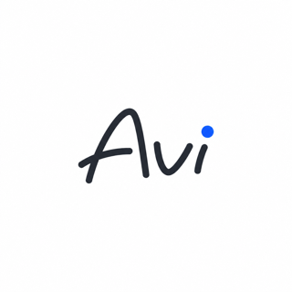

<p align="center">
  
</p>

# Avi

Avi is a SwiftUI-based macOS git client. It focuses on local-first workflows
(staging, committing, browsing history) and adds an AI-assisted commit message
generator alongside lightweight GitHub and GitLab integration.

## Status

Alpha. Avi has not had a public release yet; v0.1.0 is the first tagged build.
Expect rough edges, especially around provider authentication, OAuth, and
multi-account flows.

## Features

- Tab-based repository view with status bar, branch info, and remote actions.
- Staged / unstaged file lists in Fork-style ordering, with selection-preserving
  stage and unstage operations.
- Commit graph view with per-commit file diffs.
- Changed-files tree that defaults to fully expanded, with expand-all and
  collapse-all controls.
- AI-assisted commit message generation through a configurable command or the
  OpenAI API, with an IDE-style debug drawer for the underlying run.
- Config file with live reload; secrets stored in the macOS Keychain.
- Repository picker with search, lazy metadata hydration, and clone-from-provider.
- GitHub / GitLab account management with Personal Access Tokens and `gh` /
  `glab` CLI integration.

## Requirements

- macOS 14 (Sonoma) or later, Apple Silicon.
- Swift 6.2 toolchain (Xcode 16 or a recent Swift release).
- Optional CLI tools used by some features: `git` (required), `gh`, `glab`,
  `codex`, `claude`. Configure paths in **Settings → External Tools**.

## Build & Run

```sh
# Build everything (library + executable):
swift build

# Run the unit and snapshot tests:
swift test

# Launch the app in development:
swift run AviApp
```

If your installed Command Line Tools cannot link the SwiftPM manifest (a known
issue on stock toolchains without full Xcode), the repo ships a fallback build
script that bypasses `swift build`:

```sh
./build.sh         # builds GitKit + AppUI + AviApp into .build/manual/
./build.sh run     # build + launch
```

Tagged releases are built locally on a Mac with `swift build -c release` and
packaged by `scripts/package-app.sh`. See
[`docs/RELEASE.md`](docs/RELEASE.md) for the full runbook.

## Configuration

The config file lives at `~/Library/Application Support/Avi/config.toml`. It
is created automatically on first launch with defaults. See
[`docs/CONFIGURATION.md`](docs/CONFIGURATION.md) for the full schema and
[`config.example.toml`](config.example.toml) for a complete example.

Tokens (GitHub / GitLab PATs, AI provider API keys) are stored in the macOS
Keychain (service `com.avi`) and are never written to the config file.

## Releases

Tagged releases ship a zipped `Avi.app` bundle and a `SHA256SUMS` file on the
[GitHub Releases](https://github.com/mrcat71/avi/releases) page. Artifact names
follow the pattern `avi-<version>-macos-arm64.zip`.

Verify a download with:

```sh
shasum -a 256 -c SHA256SUMS
```

The bundle is ad-hoc signed, not notarized with a Developer ID. The first
time you launch the downloaded `Avi.app`, macOS Gatekeeper will refuse to
open it; right-click the app in Finder and pick **Open**, then click
**Open** in the warning sheet. Subsequent launches work normally.

See [`docs/RELEASE.md`](docs/RELEASE.md) for the maintainer's release checklist.

## License

Released under the MIT License. See [`LICENSE`](LICENSE).
