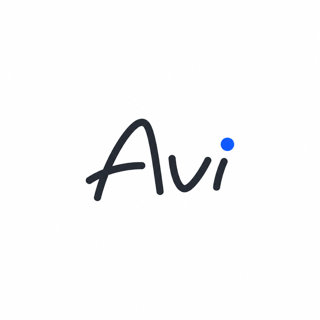
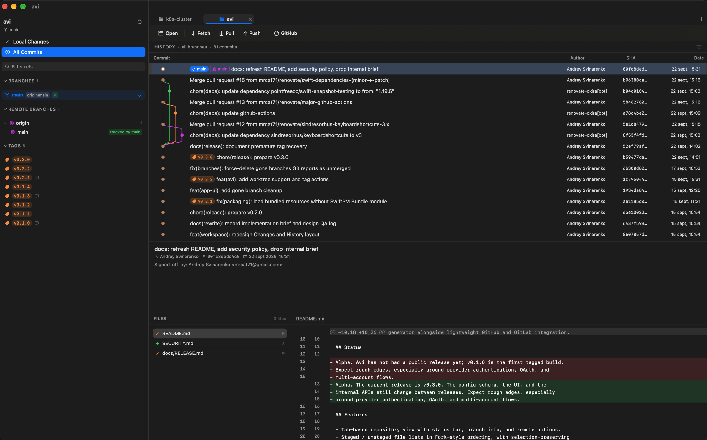

<p align="center">
  
</p>

# Avi

Avi is a SwiftUI-based macOS git client. It focuses on local-first workflows
(staging, committing, browsing history), lets Claude Code, Codex, and other
local agents hand finished work to it for review, and adds an AI-assisted
commit message generator alongside lightweight GitHub and GitLab integration.

<p align="center">
  
</p>
<p align="center">
  <em>History with the commit graph, reference sidebar, and per-commit diff.</em>
</p>

## Status

Alpha. The current release is v0.4.2. The config schema, the UI, and the
internal APIs still change between releases. Expect rough edges, especially
around provider authentication, OAuth, and multi-account flows.

## Features

- Tab-based repository view with status bar, branch info, and remote actions.
- Staged / unstaged file lists in Fork-style ordering, with selection-preserving
  stage and unstage operations.
- Plan mode for several commits at once: drafts from agents, the AI split, and
  you, grouped by who proposed them. Drag files between commits, review each
  file's full diff, tell the AI how to split, merge, or rethink them, and
  commit them one by one or all in order.
- Agent hand-off: the `avi` command lets Claude Code, Codex, and other local
  agents stage files and fill the commit message, or propose a whole commit
  plan, from several sessions at once. Nothing is committed until you approve
  it. Settings > Agents installs the command and the agent skill.
- Native selectable diff text with Find support, horizontal scrolling, and
  separate old / new line-number gutters.
- Commit graph view with per-commit file diffs, scoped to the current branch or
  to all branches.
- Changed-files tree that defaults to fully expanded, with expand-all and
  collapse-all controls.
- Sidebar sections for branches, tags, stashes, and linked worktrees: checkout,
  push and delete tags, apply / pop / drop stashes, open a worktree in its own
  tab, and clean up local branches whose upstream is gone.
- Push sheet that states whether the push updates, adopts, or creates the remote
  branch, plus "Push and Open Pull Request" for GitHub and GitLab.
- AI-assisted commit message generation through a configurable command or the
  OpenAI API (default model `gpt-6-luna`), with an IDE-style debug drawer for
  the underlying run.
- Config file with live reload; secrets stored in the macOS Keychain.
- Repository picker with search, lazy metadata hydration, and clone-from-provider.
- GitHub / GitLab account management with Personal Access Tokens and `gh` /
  `glab` CLI integration.

## Requirements

- macOS 14 (Sonoma) or later, Apple Silicon.
- Swift 6.0 toolchain or newer. The package declares
  `swift-tools-version: 6.0`; CI builds with the Swift 6.2 toolchain that ships
  with Xcode 26 on `macos-26` runners.
- Optional CLI tools used by some features: `git` (required), `gh`, `glab`,
  `codex`, `claude`. Configure paths in **Settings → External Tools**.

## Build & Run

```sh
# Build everything (library + executable):
swift build

# Run the unit and snapshot tests:
swift test

# Launch the app in development:
swift run AviApp
```

If your installed Command Line Tools cannot link the SwiftPM manifest (a known
issue on stock toolchains without full Xcode), the repo ships a fallback build
script that bypasses `swift build`:

```sh
./build.sh         # builds GitKit + AppUI + AviApp into .build/manual/
./build.sh run     # build + launch
```

Pushing a version tag triggers the GitHub Actions release workflow, which tests,
builds, packages, and publishes the app. Local builds use the same SwiftPM and
`scripts/package-app.sh` flow. See
[`docs/RELEASE.md`](docs/RELEASE.md) for the full runbook.

## Agent integration

1. **Settings > Agents > Install All** installs `~/.local/bin/avi` and the `avi`
   skill for Claude Code and Codex.
2. Open the repository in Avi once; agents can only use repositories you have
   opened.
3. Ask your agent to send its work to Avi, or let the skill do it when a task is
   done. One commit lands in the commit field with its files staged; several
   land in Plan.

Codex needs `[sandbox_workspace_write] network_access = true` (or your approval)
for `avi` to reach Avi. See
[`docs/AGENT-INTEGRATION.md`](docs/AGENT-INTEGRATION.md) for the command, the
multi-session rules, the protocol, and the security model.

## Configuration

The config file lives at `~/Library/Application Support/Avi/config.toml`. It
is created automatically on first launch with defaults. See
[`docs/CONFIGURATION.md`](docs/CONFIGURATION.md) for the full schema and
[`config.example.toml`](config.example.toml) for a complete example.

Tokens (GitHub / GitLab PATs, AI provider API keys) are stored in the macOS
Keychain (service `com.avi`) and are never written to the config file.

## Releases

Tagged releases ship a zipped `Avi.app` bundle and a `SHA256SUMS` file on the
[GitHub Releases](https://github.com/mrcat71/avi/releases) page. Artifact names
follow the pattern `avi-<version>-macos-arm64.zip`.

Verify a download with:

```sh
shasum -a 256 -c SHA256SUMS
```

The bundle is ad-hoc signed, not notarized with a Developer ID. The first
time you launch the downloaded `Avi.app`, macOS Gatekeeper will refuse to
open it; right-click the app in Finder and pick **Open**, then click
**Open** in the warning sheet. Subsequent launches work normally.

See [`docs/RELEASE.md`](docs/RELEASE.md) for the maintainer's release checklist.

## License

Released under the MIT License. See [`LICENSE`](LICENSE).
