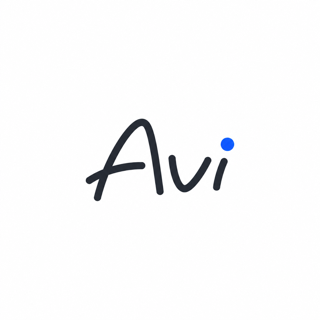
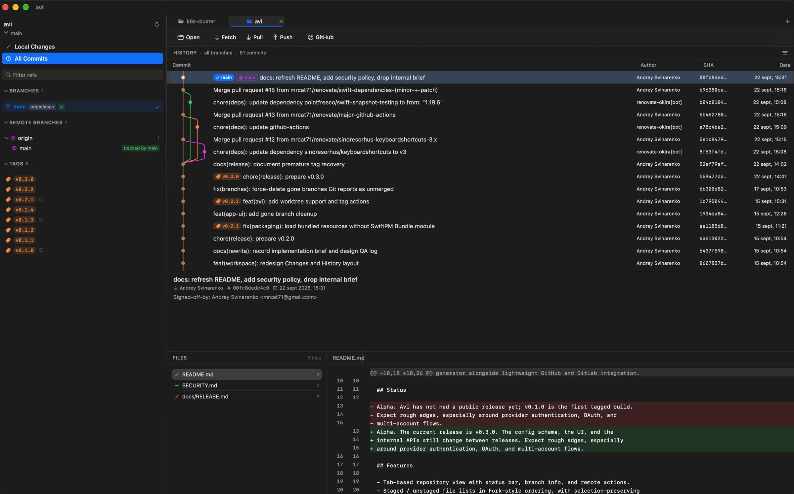

<p align="center">
  
</p>

# Avi

Avi is a SwiftUI-based macOS git client. It focuses on local-first workflows
(staging, committing, browsing history), lets Claude Code, Codex, and other
local agents hand finished work to it for review, and adds an AI-assisted
commit message generator alongside lightweight GitHub and GitLab integration.

<p align="center">
  
</p>
<p align="center">
  <em>History with the commit graph, reference sidebar, and per-commit diff.</em>
</p>

## Status

Alpha. The current release is v0.7.5. The config schema, the UI, and the
internal APIs still change between releases. Expect rough edges, especially
around provider authentication, OAuth, and multi-account flows.

## Features

- Tab-based repository view with status bar, branch info, and remote actions;
  drag tabs to reorder them. Relaunching restores the open repositories, their
  tab order, and the selected tab. Closing a tab keeps it closed on relaunch.
- Auto-fetch: once the last fetch is older than Settings > Git > Auto-fetch
  interval (5 minutes by default), the open repository fetches when you come
  back to Avi or switch to its tab, and again while Avi stays in front. A
  failed automatic fetch shows in the status bar, not as an alert.
- Fetch has no default keyboard shortcut, so Shift+Cmd+F stays available to
  other apps. Use the toolbar or Repository > Fetch; a different shortcut can
  be assigned in Settings > Keyboard.
- Staged / unstaged file lists with selection-preserving stage and unstage
  operations and arrow keys that step from file to file, past folders.
- Stage, unstage, or discard single lines: select lines in a file's diff and
  use the buttons beside them, or click in a hunk for the whole hunk. Works on
  files changed in place, in the unified diff.
- One Changes screen for one commit or several: unstaged files on top, then the
  commits you are about to make. Commit 1 is your staged files; planned commits
  from agents, the AI, and you stack under it. Drag files between commits, let
  **Split into Commits…** have the AI group the changes you staged, tell it how
  to split, merge, or rethink them, and commit one at a time or all in order.
  The Commit button says how many staged files it commits, and when it is off,
  the reason shows next to it.
- Agent hand-off: the `avi` command lets Claude Code, Codex, and other local
  agents stage files and fill the commit message, or propose a whole commit
  plan, from several sessions at once. Nothing is committed until you approve
  it. Agents > Install Agent Skills… installs the command and the agent skill.
- Native selectable diff text with Find support, horizontal scrolling, and
  separate old / new line-number gutters. A toolbar ignores whitespace, shows
  invisible characters, wraps lines, sets the lines of context or shows the
  entire file, and switches to a side-by-side view.
- Commit graph view with per-commit file diffs, scoped to the current branch or
  to all branches. Search finds commits by message, author, or the start of a
  SHA: matches are highlighted, the rest dims, and Return and Shift+Return step
  between them. **Search Commits** in the command palette opens the search.
  History loads the latest 200 commits; **Load Older Commits** adds 1,000 more
  at a time. Commits show their author's picture, from GitHub, the
  repository's GitLab, or Gravatar, with initials until one arrives, and recent
  ones say Today or Yesterday instead of a date.
- A commit menu in History: new branch or tag at the commit, an
  interactive rebase from it or a stop to edit it, reset the current branch to
  it (soft, mixed, or hard), check it out, cherry-pick or revert it, save it as
  a patch, compare it with your local changes, and copy its SHA (Cmd+C copies
  the selected commits' SHAs).
- Changed-files tree that defaults to fully expanded, with expand-all and
  collapse-all controls. Clicking a folder selects it with every file inside,
  so Stage, Unstage, Discard, and dragging act on the whole folder; the chevron
  opens and closes it.
- Sidebar sections for branches, tags, stashes, and linked worktrees: checkout,
  push tags and delete them locally or on the remote too, apply / pop / drop
  stashes, open a worktree in its own tab, and clean up local branches whose
  upstream is gone.
  Worktrees is the first section when linked worktrees exist; Remote Branches
  starts collapsed and can be expanded from its header.
- A full branch menu on every local branch: check out (bringing uncommitted
  changes along if you like) or check out as a new worktree, fast-forward to the
  fetched upstream, push, create a pull or merge request, merge into the current
  branch, rebase or interactively rebase the current branch onto it, new branch
  (Shift+Cmd+B) and tag (Shift+Cmd+G), tracking, rename, delete here and on the
  remote too, copy the name.
- A changed-file menu: open or open with, external diff (Cmd+D), Show in
  Finder, Blame/Timeline and History windows, stage (Cmd+S), discard, ignore
  through `.gitignore` or `.git/info/exclude`, stash only those files, save as
  patch, copy path.
- A merge, rebase, cherry-pick, or revert that stops on a conflict, or at a
  commit to edit, shows a banner with Continue, Skip, and Abort; a stopped
  merge's message is already in the commit field.
- Built for agents' habits: a detached HEAD says whether its commits are on
  no branch and offers to create one, and checking out something else asks
  before stranding them. Worktrees show their uncommitted changes and detached
  commits, can get a branch or be removed, and worktrees inside the repository
  folder never appear in Changes or get staged.
- Push sheet that states whether the push updates, adopts, or creates the remote
  branch, for the current branch or any other.
- AI-assisted commit message generation, one click on **Generate** in the
  commit card, through a configurable command or the OpenAI API (default model
  `gpt-6-luna`). AI work shows how long it has been running, and an IDE-style
  debug drawer shows the underlying run.
- Config file with live reload; secrets stored in the macOS Keychain.
- Repository picker with search, lazy metadata hydration, and cloning from any
  `gh` or `glab` account, or from a URL over HTTPS with the account you pick or
  over SSH with your keys. Dropping folders on the window opens them, each in
  its own tab.
- Pull and merge requests open on GitHub, gitlab.com, and self-hosted GitLab:
  an instance whose name does not say "gitlab" is recognized when `glab` is
  signed in to it or Settings > GitLab has a token for it.
- GitHub / GitLab account management with Personal Access Tokens and `gh` /
  `glab` CLI integration.
- Updates itself through Sparkle, verifying each update with Avi's signing
  key, and installs from a drag-to-Applications disk image.

## Requirements

- macOS 14 (Sonoma) or later, Apple Silicon.
- Swift 6.0 toolchain or newer. The package declares
  `swift-tools-version: 6.0`; CI builds with the Swift 6.2 toolchain that ships
  with Xcode 26 on `macos-26` runners.
- Optional CLI tools used by some features: `git` (required), `gh`, `glab`,
  `codex`, `claude`. Configure paths in **Settings → External Tools**.

## Build & Run

```sh
# Build everything (library + executable):
swift build

# Run the unit and snapshot tests:
swift test

# Launch the app in development:
swift run AviApp
```

If your installed Command Line Tools cannot link the SwiftPM manifest (a known
issue on stock toolchains without full Xcode), the repo ships a fallback build
script that bypasses `swift build`:

```sh
./build.sh         # builds GitKit + AppUI + AviApp into .build/manual/
./build.sh run     # build + launch
```

Pushing a version tag triggers the GitHub Actions release workflow, which tests,
builds, packages, signs the update feed, and publishes the app. Local builds use
the same SwiftPM and `scripts/package-app.sh` flow. See
[`docs/RELEASE.md`](docs/RELEASE.md) for the full runbook.

### Dependency updates

Renovate waits seven days from release for updates subject to release-age
checks before creating a branch (`internalChecksFilter: strict`). CI runs on
`renovate/**` before a PR exists. Once branch checks pass, Renovate opens the PR
and assigns `mrcat71` and requests their review, including automerge PRs
(`assignAutomerge: true`). Review requests are added at PR creation, not
retroactively to existing PRs. There is no weekly creation window or second
seven-day wait inside the PR. Internal release-age
checks do not substitute for CI. Updates missing required release timestamps
remain pending in the Dependency Dashboard. Vulnerability alerts skip the age
delay but still wait for successful branch checks. PR merge-commit checks run
again after creation. The policy lives in `.github/renovate.json`.

## Agent integration

1. **Agents > Install Agent Skills…** opens Settings > Agents; **Install All**
   installs `~/.local/bin/avi` and the `avi` skill for Claude Code and Codex.
   **Agents > How to Use Avi with AI Agents…** walks through the rest.
2. Open the repository in Avi once; agents can only use repositories you have
   opened.
3. Ask your agent to send its work to Avi, or let the skill do it when a task is
   done. One commit lands in the commit field with its files staged; several
   become planned commits under it.

Codex needs `[sandbox_workspace_write] network_access = true` (or your approval)
for `avi` to reach Avi. See
[`docs/AGENT-INTEGRATION.md`](docs/AGENT-INTEGRATION.md) for the command, the
multi-session rules, the protocol, and the security model.

## Configuration

The config file lives at `~/Library/Application Support/Avi/config.toml`. It
is created automatically on first launch with defaults. See
[`docs/CONFIGURATION.md`](docs/CONFIGURATION.md) for the full schema and
[`config.example.toml`](config.example.toml) for a complete example.

Tokens (GitHub / GitLab PATs, AI provider API keys) are stored in the macOS
Keychain (service `com.avi`) and are never written to the config file.

## Releases

Each tagged release on the
[GitHub Releases](https://github.com/mrcat71/avi/releases) page ships:

- `avi-<version>-macos-arm64.dmg`: open it and drag **Avi** onto the
  **Applications** folder next to it.
- `avi-<version>-macos-arm64.zip`: the same app; in-app updates install from it.
- `appcast.xml`: the signed update feed that installed copies read.
- `SHA256SUMS`: checksums for the disk image and the zip.

Verify a download with:

```sh
shasum -a 256 -c SHA256SUMS --ignore-missing
```

The app is ad-hoc signed, not notarized with a Developer ID, so macOS
Gatekeeper refuses the first launch of a downloaded copy. On macOS 15 and
later, open System Settings > Privacy & Security and click **Open Anyway**
under Security, then confirm. On macOS 14, right-click the app in Finder, pick
**Open**, and click **Open** in the warning sheet. Later launches work
normally.

### Updates

From 0.7.1 on, Avi updates itself through
[Sparkle](https://sparkle-project.org). It checks once a day, and
**Avi > Check for Updates…** checks right away. Settings > General > Updates
turns the daily check off, or has Avi download updates in the background and
install them when you quit. Avi installs an update only when the feed and the
download carry valid signatures from Avi's EdDSA key, whose public half is
built into the app, and an updated Avi opens without the Gatekeeper warning.
Versions up to 0.7.0 have no updater: install 0.7.1 or later from the disk
image once.

See [`docs/RELEASE.md`](docs/RELEASE.md) for the maintainer's release checklist.

## License

Released under the MIT License. See [`LICENSE`](LICENSE).
